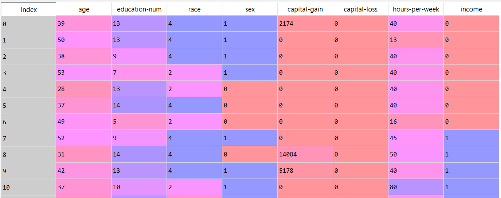

### Project Overview

# Census Analysis using NumPy

In this project, we will conduct analysis census data.

### Aim of this Project

It is a guided project, aimed at training the learner with industry level dataset. In this project I had the opportunity to learn how to make analysis using Numpy on data.

### About the Dataset

Snapshot of the data

The dataset has details of 100 people with the following 8 features

### Learnings from the project

 - NumPy functions
- Manipulation of data using Numpy
- Array Appending
- Array Slicing
- Array Filtering
- Array Aggregation
