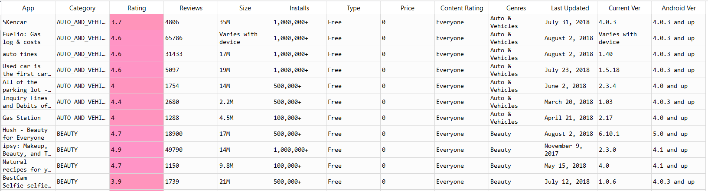

### Project Overview

# High Rated Games on Google Playstore

Google Play Store serves as the official app store for the Android operating system, allowing users to browse and download applications. Success of an app is largely determined by its ratings.

But is there any particular pattern among high rated apps? Does size or genre of the app play a role in determining its high rating?

### Aim of the Project

It is a guided project, aimed at training the learner with industry level dataset. In this project I had the opportunity to learn how to conduct Exploratory Data Analysis and Data Pre-processing on datasets.

#### Author : Praveen Shekar

#### Language : Python 3

#### Source of the Dataset : [Google Play Store Apps] (https://www.kaggle.com/lava18/google-play-store-apps "Playstore Apps Store")

### About the Dataset

Snapshot of the Data

The dataset has details of 10841 apps with following 13 features.

### Learnings from the project

In this project the following concepts were applied:
- Data Encoding
- Handling missing data
- Treatment of Outliers
- Data Transformation
