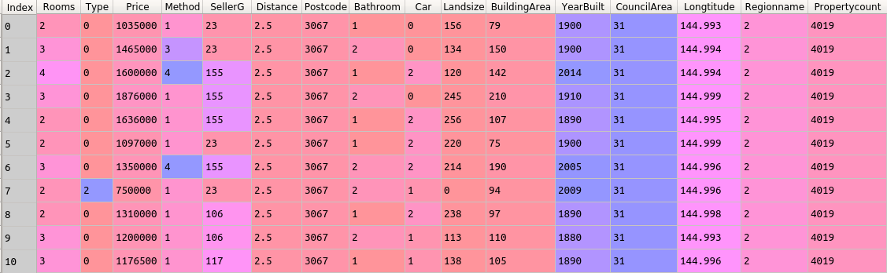

### Project Overview

 # Moving Residence Analysis(Melbourne)

Each observation is a different house attribute with various features, like the number of properties that exist in the suburb, land size, building size, governing council for the area, real estate agent, price of the house, etc.

### Aim of the Project

It is a guided project, aimed at training the learner with industry level dataset. In this project, I had the opportunity to learn the methods of Regularization to be applied on the model.

#### Author : Praveen Shekar

#### Language : Python 3

### About the Dataset

Snapshot of the dataset

### Learnings from the project

 - Train Test split function.
- Calculating the Correlation between the features.
- Creating a Linear Regression model.
- Checking Polynomial Features.
- Lasso Regressor.
- Ridge Regressor.
- Calculating R-squared Evaluation metrics.

### Challenges faced

 - Using 'make_pipeline()' function.

