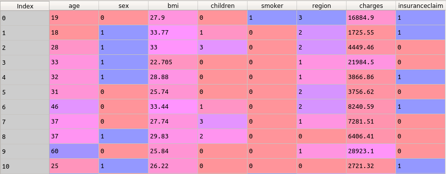

### Project Overview

 # Insurance Claim Prediction

In this project, we are going to predict the Insurance claim using logistic regression. This dataset contains information on the insurance claim. each observation is different policyholder with various features like the age of the person, the gender of the policyholder, body mass index, providing an understanding of the body, number of children of the policyholder, smoking state of the policyholder and individual medical costs billed by health insurance.

### Aim of the project

It is a guided project, aimed at training the learner with industry level dataset. In this project I had the opportunity to learn how to make predictions on Categorical data using Logistic Regression.

#### Author : Praveen Shekar

#### Language : Python 3

### About the Dataset

Snapshot of the Data -

The dataset has details of 10841 apps with following 13 features.

### Learnings from the project

n this project the following concepts were applied:
- Train-test split
- Correlation between the features
- Logistic Regression
- Auc score
- Roc AUC plot

