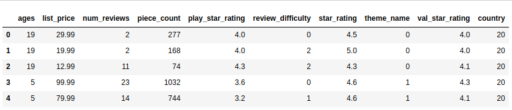

### Project Overview

# Lego-set-Analysis

 This dataset contains information on lego sets scraped from lego.com. Each observation is a different lego set with various features like how many pieces in the set, rating for the set, number of reviews per set etc. Your aim is to build a linear regression model to predict the price of a set.

 ### Aim of the Project

It is a guided project, aimed at training the learner with industry level dataset. In this project I had the opportunity to learn how to build a Linear Regression model to make predictions on data.

#### Author : Praveen Shekar

#### Language : Python 3

### About the Dataset

Snapshot of the Data

The dataset has details of 12261 lego sets with the following 10 features

### Learnings from the project

- Train test split.
- Correlation between the features.
- Linear Regression.
- Root Mean Squared Error and R-squared evaluation metrics.

### Challenges faced

- Checking the correlation between individual features and target variable using scatter plot.