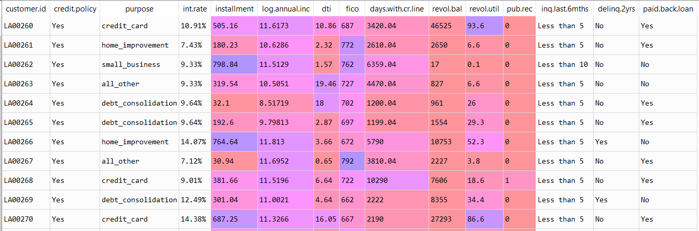

### Project Overview

# Probability of the Loan Defaulters

For this project, we will be exploring the publicly available data from LendingClub.com. Lending Club connects people who need money (borrowers) with people who have money (investors). As an investor one would want to invest in people who showed a profile of having a high probability of paying the amount back.

### Aim of the Project

It is a guided project, aimed at training the learner with industry level dataset. In this project I had the opportunity to learn how to use the concepts of probability for making predictions on the dataset.

#### Author : Praveen Shekar

#### Language : Python 3

#### Source of the Dataset : https://www.lendingclub.com

### About the Dataset

Snapshot of the Data

The dataset has details of 10841 apps with following 13 features.

### Learnings from the project

In this project the following concepts were applied:
- Independency check.
- Bayes Theorem.
- Visualizing discrete variable.
- Visualizing continuous variable.

### Challenges faced

 Applying Bayes theorem on the dataset.

