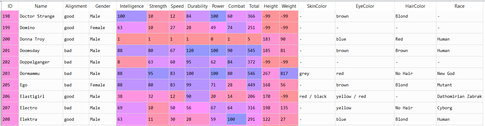

### Project Overview

# Superhero Statistics Analysis

The rise of superheroes and supervillains is at an all time high. The 'Academy of Super Beings(ASB)' was formed to bring order to it. We have with us the data of more than 500 super humans but we need your knowledge of descriptive statistics in figuring out the important insights from it. 

### Aim of this project

It is a guided project, aimed at training the learner with industry level dataset. In this project I had the opportunity to learn how to get insights using the concepts of statistics on datasets.

#### Author : Praveen Shekar

#### Language : Python 3

### About the Dataset

Snapshot of the Data

The dataset has details of 594 super hero characters with 17 features.

### Learnings from the project

- Bar plotting.
- Boxplot plotting.
- Pie-chart plotting.
- Subplot operations.
- Feature Correlation.
- IQR operations.

### Challenges faced

- Using the Pearson's equation.
- Using .quantile() function.