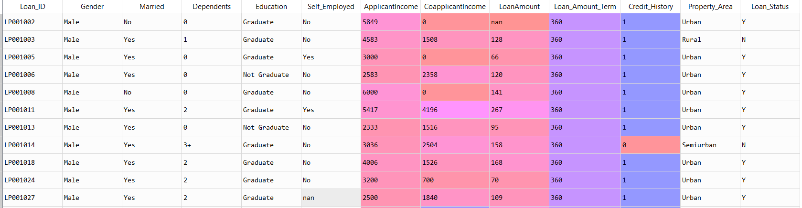

### Project Overview

# Visualization for Company Stakeholders

In this project we will make use of Dream Housing Finance company's dataset to get visual insights on the company's operations. Using the data visualization techniques, we will visualise the data and arrive at some inference based on the visual plots.

### Aim of the Project

It is a guided project, aimed at training the learner with industry level dataset. In this project I had the opportunity to learn how to use python visualization plots to make inference on data.

#### Author : Praveen Shekar

#### Language : Python 3

### About the Dataset

Snapshot of the Data

The dataset has details of 10841 apps with following 13 features.

### Learnings from the Project

- Bar plotting.
- Scatter plotting.
- Kernel Density plotting.
- Subplot operations.
- Axes modification.
